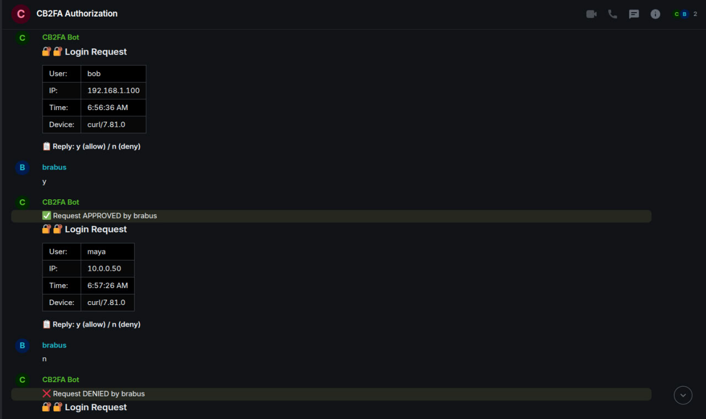

# CB2FA - Community-Based Two-Factor Authentication

**Made for Matrix with love by EasyProTech LLC (www.easypro.tech)**  
**Developer: Brabus**

## Overview

CB2FA is a lightweight, community-based two-factor authentication system for Matrix homeservers. It intercepts login requests and requires approval from trusted community members via simple y/n commands in a Matrix room.

## Features

- 🔐 **Community-based approval** - Trust your community members to approve logins
- ✅ **Simple y/n commands** - No complex UI, just reply 'y' or 'n' in Matrix 
- 📊 **Clean tables** - Clear display of login details
- 🌍 **Internationalization** - English and Russian language support
- ⚡ **Lightweight** - Built with Deno and TypeScript, minimal dependencies
- 🛡️ **Secure** - Validates credentials with Synapse before requesting approval
- 🔄 **Smart Queue** - Handles multiple simultaneous login attempts elegantly
- 📦 **Fully Portable** - No hardcoded domains or paths, works anywhere

## Quick Start

1. **Clone and Configure:**
   ```bash
   git clone <repo>
   cd cb2fa
   cp .env.example .env
   # Edit .env with your Matrix settings
   ```

2. **Install Deno:**
   ```bash
   curl -fsSL https://deno.land/install.sh | sh
   ```

3. **Start Services:**
   ```bash
   # Start the bot
   deno run --allow-net --allow-env --allow-read src/main.ts

   # Start the middleware (in another terminal)
   deno run --allow-net --allow-env --allow-read middleware/middleware.ts
   ```

4. **Configure nginx to proxy login requests:**
   ```nginx
   location ~ ^/_matrix/client/(r0|v3)/login$ {
       proxy_pass http://127.0.0.1:9999;  # or your CB2FA_MIDDLEWARE_PORT
       proxy_set_header X-Forwarded-For $remote_addr;
       proxy_set_header Host $host;
   }
   ```

## Configuration (.env)

```bash
# Matrix Configuration
MATRIX_HOMESERVER_URL=http://localhost:8008
MATRIX_BOT_USERNAME=cb2fa_bot
MATRIX_BOT_PASSWORD=your_bot_password
MATRIX_DOMAIN=your-matrix-domain.com

# CB2FA Settings  
MATRIX_ADMIN_FOR_AUTH=admin
CB2FA_INVITED_USERS=admin,alice,bob
CB2FA_ROOM_NAME=CB2FA Authorization
CB2FA_TIMEOUT_MINUTES=15

# Ports (customize as needed)
CB2FA_BOT_PORT=10000
CB2FA_MIDDLEWARE_PORT=9999

# Language
LANGUAGE=en
```

## How It Works

1. **User attempts Matrix login** via any client (Element, etc.)
2. **nginx routes login** to CB2FA middleware
3. **Middleware validates credentials** with Synapse
4. **If valid, creates approval request** via bot
5. **Bot sends clean table** to Matrix room
6. **Community members respond** with simple 'y' or 'n'
7. **Login succeeds or fails** based on community decision

## Queue System

- ✅ **One active request at a time** - Clear focus for trusted users
- ✅ **Automatic queue management** - Others wait in line
- ✅ **No user confusion** - Standard Matrix "connecting..." experience
- ✅ **Anti-DDoS protection** - Natural rate limiting

## Architecture

```
User Login → nginx → CB2FA Middleware → Queue → Bot → Matrix Room → Trusted User Decision
```

## Production Deployment

1. **Create Matrix bot account**
2. **Configure environment variables**
3. **Set up nginx proxy**
4. **Run as systemd services**
5. **Invite trusted users to CB2FA room**

## License

MIT License - Made with ❤️ for the Matrix community

---

**Deploy anywhere, configure everything, hardcode nothing!** 🚀

## 🌍 Supported Languages

CB2FA supports multiple languages for the interface:

- 🇬🇧 **English** (`LANGUAGE=en`) - Default
- 🇷🇺 **Russian** (`LANGUAGE=ru`) - Русский
- 🇩🇪 **German** (`LANGUAGE=de`) - Deutsch  
- 🇨🇳 **Chinese (Simplified)** (`LANGUAGE=zh-cn`) - 中文 (简体)
- 🇫🇷 **French** (`LANGUAGE=fr`) - Français
- 🇪🇸 **Spanish** (`LANGUAGE=es`) - Español
- 🇹🇷 **Turkish** (`LANGUAGE=tr`) - Türkçe

Simply set the `LANGUAGE` variable in your `.env` file to switch languages.

## 📸 Screenshots


*CB2FA showing clean login approval tables in Matrix chat with trusted users bob, maya, and alice*

## 📞 Support

I do not provide support. I do not consult — not for free, not for money, not in any form.

Please don't ask for help, fixes, or explanations — this project is released as-is.

If someone wants to help with development — contributions are welcome. But there are no obligations from my side whatsoever.

## 📖 Documentation

- 🇬🇧 [English README](README.md)
- 🇷🇺 [Русская документация](README_RU.md)

