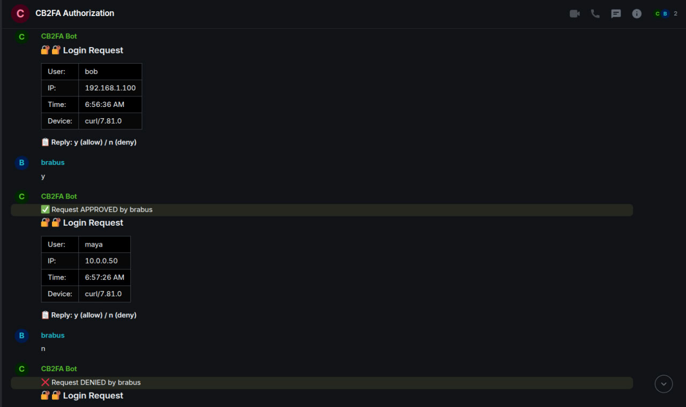

# CB2FA - Двухфакторная Аутентификация на Основе Сообщества

**Сделано для Matrix с любовью от EasyProTech LLC (www.easypro.tech)**  
**Разработчик: Brabus**

## Обзор

CB2FA - это легковесная система двухфакторной аутентификации на основе сообщества для Matrix серверов. Она перехватывает запросы на вход и требует одобрения от доверенных членов сообщества через простые команды 'y' или 'n' в Matrix комнате.

## Возможности

- 🔐 **Одобрение сообществом** - Доверьте вашим участникам сообщества одобрять входы
- ✅ **Простые команды y/n** - Никаких сложных интерфейсов, просто ответьте 'y' или 'n' в Matrix 
- 📊 **Аккуратные таблицы** - Четкое отображение деталей входа
- 🌍 **Интернационализация** - Поддержка английского и русского языков
- ⚡ **Легковесность** - Построен на Deno и TypeScript, минимум зависимостей
- 🛡️ **Безопасность** - Проверяет учетные данные с Synapse перед запросом одобрения
- �� **Умная очередь** - Элегантно обрабатывает множественные попытки входа
- 📦 **Полная портабельность** - Никаких жестко заданных доменов или путей, работает везде

## Быстрый Старт

1. **Клонировать и настроить:**
   ```bash
   git clone <repo>
   cd cb2fa
   cp .env.example .env
   # Отредактируйте .env с вашими настройками Matrix
   ```

2. **Установить Deno:**
   ```bash
   curl -fsSL https://deno.land/install.sh | sh
   ```

3. **Запустить сервисы:**
   ```bash
   # Запустить бота
   deno run --allow-net --allow-env --allow-read src/main.ts

   # Запустить middleware (в другом терминале)
   deno run --allow-net --allow-env --allow-read middleware/middleware.ts
   ```

4. **Настроить nginx для проксирования запросов входа:**
   ```nginx
   location ~ ^/_matrix/client/(r0|v3)/login$ {
       proxy_pass http://127.0.0.1:9999;  # или ваш CB2FA_MIDDLEWARE_PORT
       proxy_set_header X-Forwarded-For $remote_addr;
       proxy_set_header Host $host;
   }
   ```

## Конфигурация (.env)

```bash
# Настройки Matrix
MATRIX_HOMESERVER_URL=http://localhost:8008
MATRIX_BOT_USERNAME=cb2fa_bot
MATRIX_BOT_PASSWORD=пароль_вашего_бота
MATRIX_DOMAIN=ваш-matrix-домен.com

# Настройки CB2FA  
MATRIX_ADMIN_FOR_AUTH=admin
CB2FA_INVITED_USERS=admin,алиса,боб
CB2FA_ROOM_NAME=CB2FA Авторизация
CB2FA_TIMEOUT_MINUTES=15

# Порты (настройте по необходимости)
CB2FA_BOT_PORT=10000
CB2FA_MIDDLEWARE_PORT=9999

# Язык
LANGUAGE=ru
```

## Как Это Работает

1. **Пользователь пытается войти в Matrix** через любой клиент (Element и т.д.)
2. **nginx направляет вход** к CB2FA middleware
3. **Middleware проверяет учетные данные** с Synapse
4. **Если данные верны, создает запрос на одобрение** через бота
5. **Бот отправляет аккуратную таблицу** в Matrix комнату
6. **Участники сообщества отвечают** простыми 'y' или 'n'
7. **Вход успешен или неудачен** на основе решения сообщества

## Система Очереди

- ✅ **Один активный запрос за раз** - Четкий фокус для доверенных пользователей
- ✅ **Автоматическое управление очередью** - Остальные ждут в очереди
- ✅ **Никакой путаницы для пользователей** - Стандартное Matrix "подключение..." состояние
- ✅ **Защита от DDoS** - Естественное ограничение скорости

## Архитектура

```
Вход Пользователя → nginx → CB2FA Middleware → Очередь → Бот → Matrix Комната → Решение Админа
```

## Производственное Развертывание

1. **Создать аккаунт Matrix бота**
2. **Настроить переменные окружения**
3. **Настроить nginx прокси**
4. **Запустить как systemd сервисы**
5. **Пригласить доверенных пользователей в CB2FA комнату**

## Примеры Использования

### Запуск в продакшене
```bash
# Создать системные сервисы
sudo systemctl enable cb2fa-bot
sudo systemctl enable cb2fa-middleware
sudo systemctl start cb2fa-bot cb2fa-middleware
```

### Мониторинг
```bash
# Проверить статус
curl http://localhost:10000/health
curl http://localhost:9999/health

# Посмотреть логи
journalctl -u cb2fa-bot -f
journalctl -u cb2fa-middleware -f
```

### Настройка для различных доменов
```bash
# Для локальной разработки
MATRIX_DOMAIN=localhost
MATRIX_HOMESERVER_URL=http://localhost:8008

# Для продакшена
MATRIX_DOMAIN=matrix.company.com  
MATRIX_HOMESERVER_URL=https://matrix.company.com
```

## Поддерживаемые Языки

- 🇺🇸 **Английский** (`LANGUAGE=en`)
- 🇷🇺 **Русский** (`LANGUAGE=ru`)

Добавление новых языков просто - отредактируйте `src/i18n.ts`.

## Безопасность

- ✅ **Проверка учетных данных** - Сначала проверяется с Synapse
- ✅ **Нет открытых API** - Все endpoints внутренние
- ✅ **Таймауты** - Запросы автоматически истекают
- ✅ **Очередь** - Защита от спама запросов

## Устранение Неполадок

### Бот не подключается к Matrix
```bash
# Проверить настройки
grep MATRIX .env
curl $MATRIX_HOMESERVER_URL/_matrix/client/versions
```

### Middleware не перехватывает логины
```bash
# Проверить nginx конфигурацию
nginx -t
curl -X POST http://localhost:9999/health
```

### Запросы не приходят в комнату
```bash
# Проверить права бота
curl http://localhost:10000/cb2fa/status
```

## Лицензия

MIT License - Сделано с ❤️ для Matrix сообщества

---

**Разворачивайте где угодно, настраивайте все, ничего не зашивайте в код!** 🚀

## 🌍 Поддерживаемые Языки

CB2FA поддерживает множество языков интерфейса:

- 🇬🇧 **Английский** (`LANGUAGE=en`) - По умолчанию
- 🇷🇺 **Русский** (`LANGUAGE=ru`) - Текущий
- 🇩🇪 **Немецкий** (`LANGUAGE=de`) - Deutsch  
- 🇨🇳 **Китайский (упрощённый)** (`LANGUAGE=zh-cn`) - 中文 (简体)
- 🇫🇷 **Французский** (`LANGUAGE=fr`) - Français
- 🇪🇸 **Испанский** (`LANGUAGE=es`) - Español
- 🇹🇷 **Турецкий** (`LANGUAGE=tr`) - Türkçe

Просто установите переменную `LANGUAGE` в вашем `.env` файле для переключения языков.

## 📸 Скриншоты


*CB2FA показывает аккуратные таблицы запросов входа в Matrix чате с доверенными пользователями bob, maya и alice*

## 📞 Поддержка

Я не предоставляю поддержку. Я не консультирую — ни бесплатно, ни за деньги, ни в какой форме.

Пожалуйста, не просите помощи, исправлений или объяснений — этот проект выпускается как есть.

Если кто-то хочет помочь с разработкой — вклады приветствуются. Но с моей стороны никаких обязательств нет.

## 📖 Документация

- 🇬🇧 [English Documentation](README.md)
- 🇷🇺 [Русская документация](README_RU.md)

